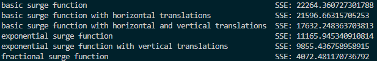

# SSE calculator for non-linear function regressions

## Overview

A SSE calculator to calculate the Sun Squared Error to evaluate the effectiveness of a non-linear regression.
I created this for my Unit 3 Mathematical Methods assignment to evaulate the effectiveness of a surge function's modelling of data.
The `C` and `t` variables represent the Concentration and Time data respectively.




## Run

```sh
$ python3 SSE.py
```

## Acknoledgements

Created by Nasser Kessas

## Contributing

PRs accepted, feel free to dive in! [Open an issue](https://github.com/nasserkessas/c-trig_grapher/issues/new) or submit PRs.

C Trig Grapher follows the [Contributor Covenant](http://contributor-covenant.org/version/1/3/0/) Code of Conduct.